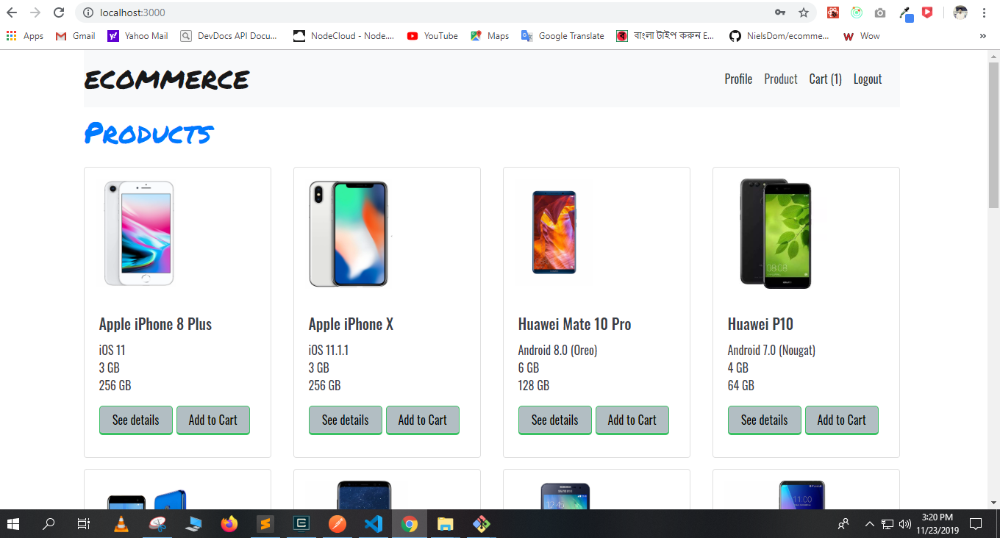

# ecommerce-mern-project

Technology I have used :
1. React JS
2. Redux
2. Node JS
3. MongoDB/mongoose

What you need to run this code :

1. Node
2. NPM
3. MongoDB, Mongoose

How to run this code :

1. Make sure MongoDB ATLAS is running
2. Clone this repository
3. Update process.env.dbpassword, dbusername value with your test values for mongoDB in config/db.js file and update jwtsecret in  routes/register.js and routes/auth.js    file
4. update jwt process.env.secret in middleware/auth.js file
5. Open command line in the cloned folder, To install dependencies, for front end go cd ecommerce/client and run npm install,
  for back end cd ecommerce and run npm install
6. To run the application for development, go to your root folder of the project and run- npm run dev
7. Open localhost:3000 in the browser.
